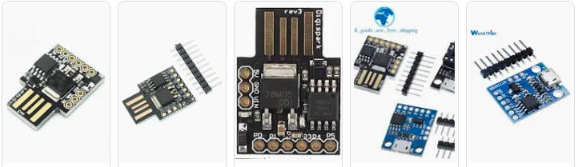
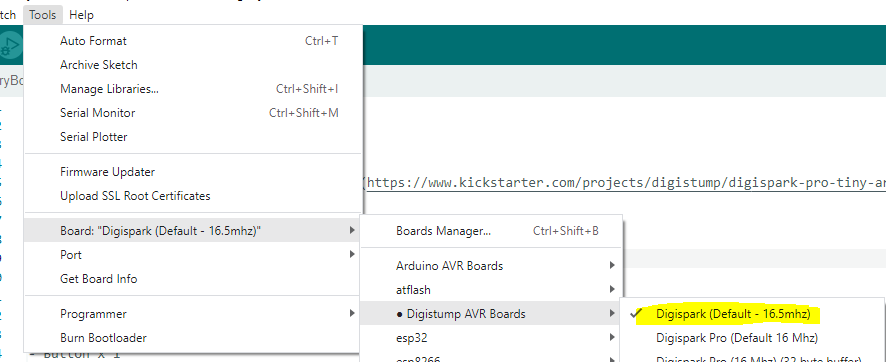
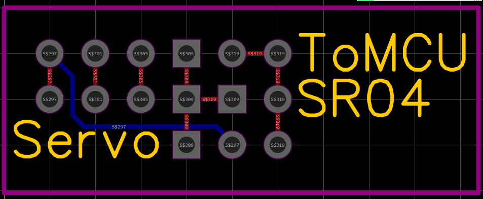

# Hungry Bot Recycle Bin

## Overview

- This source code used for [Digispark Pro](https://www.kickstarter.com/projects/digistump/digispark-pro-tiny-arduino-ready-mobile-and-usb-de)\
  \
  [Xem hướng dẫn](https://neittien0110.github.io/MCU/ATTiny/Digispark_Kickstarter_ATTiny85.html)

_Chú ý: không cắm PIN 3 (USB D+) khi nạp code._

## Bill of Material

|---|---|---|
|Name|Qty|Mapping|
|---|---|---|
|Digispark Default | 1 (*) ||
|Ultrasonic Distance Sensor SR-04 | 1 (*) |ECHO = PIN 0 , TRIG = PIN 1|
|Servo SG90s | 1 (*) | PIN_SERVOHAND = 3|
|Led 5mm | 1 |  PIN_LED = 1|
|Light resistor | 1 | 220 Ohm|

- [3D printed parts](https://www.thingiverse.com/thing:5160440)

*: mandatory

  

## HungryBotShield

### Board cắm tự nối dây

### Board mạch in

## Video

- [Demo](https://youtu.be/PHz48JWzXpA)
